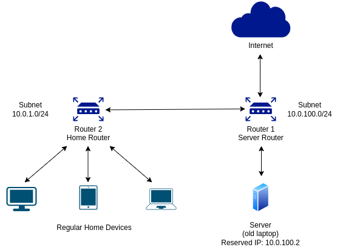

> More in this series:  
[🧮 Part 1: Setting up the Network 🧮](https://www.shivanshbakshi.dev/blog/home-server/pt-1-setting-up-the-network/)  
[Part 2: Configuring Zero Trust Access to your Server](https://www.shivanshbakshi.dev/blog/home-server/pt-2-configuring-zero-trust-access/)

## Introduction

I have always wanted to set up my own personal server. It provides an interesting new purpose to old laptops or PCs that would otherwise be discarded for scrap, and if configured correctly, can become a very secure way to store anything.

There are plenty of other reasons why one might want to build their own server. Maybe you want to host a game thats accessible to your friends, or maybe you want to have a personal Git host. Maybe you want to build a media server for all your personal videos, or maybe you just want to learn something new.

Building your own server is also a great start towards understanding how Cloud technologies work. You will come across similar concepts of networking when you try to host on a cloud platform such as Google Cloud Platform, Azure, AWS, or any other.

While this part of setting up a home server is completely optional, I highly recommend doing it. The internet is big. And countless attack attempts are made on public servers everyday. You would want to ensure that even if your server is compromised, your personal devices stay safe.

**What you need to get started:**
- A computer you want to use as your server (maybe an old laptop/PC)
- An extra router (most ISPs provide a new router for free when you get a new connection. You can use the old router as the extra router)
- A stable internet connection

**Disclaimer: The information provided is purely for general and educational purposes and does not constitute network security advice. The information may not be up-to-date with latest security standards or vulnerabilities. Any third-party links are purely for reference and are not affiliate links.** 

## The Internet

Before we begin setting up our server, it is important to build some foundational knowledge of how the internet works. Ofcourse, this is a vast topic, far beyond the scope of a mere blog post, but I will cover the basics needed for setting up your server. 

This post assumes you have a basic understanding of IP Address allocation, Subnet Masks, Classful and Classless (CIDR) address, and network ports. I will only briefly introduce some topics I encountered while setting up my own server. If you are familiar with static and dynamic IP, exposing Ports, Firewalls, NAT and CGNAT, and Zero Trust Model, feel free to skip this section and head to [Building your Server](#building-your-server).

### How you get Internet

When you get a new connection from an ISP, they (often) provide you a router, connect some cables, and within a few minutes, you're connected to the internet. What's happening behind the scenes is much more complex than what's visible to the end users (us).


When you connect a device to your Wi-Fi, the router provides it an IP address from a set of IP addresses available to it. This is your device's internal IP, and is most often from the ranges described by [RFC 1918](https://datatracker.ietf.org/doc/html/rfc1918), i.e.,
- 10.0.0.0/8
- 172.16.0.0/12
- 192.168.0.0/16

These IPs are not exposed to the world, and are limited to your router. Whenever your device connects to the router, it gets a new IP address from this address space. When you make a request to the public internet, the world does not see this IP address. It sees the IP address of the router. Most commercial routers perform Network Address Translation (NAT), so the server cannot respond to your personal devices directly, but only to the router. The router finally decides which device to send the response to based on where it is coming from. A router maintains a lookup table for this purpose.

A quick google search reveals plenty more details behind the working of NAT. For the purpose of our home server, it suffices to understand that just running a server OS on your device does not make it accessible from the public internet.

### Opening up

Let's consider you want to host a website, and that you're serving pages over HTTP (port 80). In the simplest case presented in the image above, you could simply go to your router's settings page (Most often, the xxx.xxx.xxx.1 IP on your subnet). There, you can find the option to specify Port forwarding rules.


Here, you can specify a mapping for external Ports to internal services, for example,
| External Port     | Internal IP | Internal Port | Protocol |
| :---------------: | :---------: | :-----------: | :------: |
| 80                | 192.168.0.4 | 80            | TCP      |

Here, you're specifying that forward any requests that come to the router on port 80 over TCP to the internal device on IP address 192.168.0.4:80. 

Just specifying the port forwarding rules may not be enough. Your router might have a firewall that prevents all ingress traffic, or your server device might have one. These firewalls might prevent your server from being accessible over the internet. To get up and running, you will have to configure the firewall to allow traffic on the required ports as well (in this case, Port 80).

**Note:** The default denial of ingress by firewalls exist for a good reason. It is not recommended to open these directly unless you know what you're doing. 

### Static and Dynamic IP

Most commercial ISPs do not provide your router a static IP by default. They have a DHCP renewal period, which could be in the frequency of every few days or every few weeks. Thus, the IP address of your router (and thus, your server) will keep changing. If this is of no concern to you because you want to access your server only internally, great. But for all other use cases where you want to be able to access your server from anywhere, you'll have to handle this. There are two well-known options for this.

#### Purchasing a static IP

Most ISP's let you purchase a static IP for some charge. They might ask for descriptions or further clarification as to why you need one. You can contact your ISP for further clarifications on this route. 

After you purchase a static IP, you can use this to refer to your server from anywhere in the world.

#### Set up Dynamic DNS (DDNS)

You can set up a domain with Dynamic DNS (if you already own one), or get started with it for free using DDNS providers like [No-IP](https://www.noip.com/), [Dynu](https://www.dynu.com/en-US), [CloudDNS](https://www.cloudns.net/), and many more.

In a quick glance, DDNS handles your changing IP by providing you with a Fully Qualified Domain Name (FQDN). Internally, your server keeps updating the DNS provider with updated information about it's current external IP. Thus, the DNS record is always up-to-date with your server's IP and you can reach it via the FQDN.

### Carrier-Grade NAT (CGNAT)

If you observe that the WAN IP of your router begins with one of the private address prefixes, or is different from the IP shown on public sites such as [whatsmyipaddress](https://whatismyipaddress.com/), then you're most likely behind a CGNAT. 


Carrier-Grade NAT is another layer of NAT over your router. Think of it as your router being behind another router of your ISP. In this case, simply opening the ports on your router will NOT make your server accessible from the internet, since the request will get blocked at your ISP. In such cases, you are left with no choice but to request your ISP to allow it to open ports, which they most certainly will not without you purchasing a static IP from them.

An alternative could be to switch to IPv6 addressing, since an IPv6 address – *ideally* – directly refers to the device it is attached to, but this did not work for me and needs further diving into.

### Zero Trust Model

Static IP or DDNS, both options require you to expose ports from your router and firewall. This is extremely unsafe, especially if you are just starting out in networking. Without proper protections in place, you would be leaving your network open to attacks from the entire world. Without the guidance of network experts, this is a task bound to leave loopholes.

From [Cloudflare](https://www.cloudflare.com/learning/security/glossary/what-is-zero-trust/), 
> Zero trust security is a model that requires strict identity verification for every person and device trying to access resources on a private network, regardless of whether they are sitting within or outside the network perimeter.

This third option lets you access resources on your internal server from outside the network, without exposing any ports or opening your firewall. It does so via **tunnelling**.


In this model, applications are never exposed to the internet. They are only visible to authenticated users. A quick google search on Zero Trust Model reveals far more than this blog post can, but you can read more on Cloudflare's site [here](https://www.cloudflare.com/zero-trust/), or Winlow TG's site [here](https://winslowtg.com/zero-trust-network-access-ztna-a-network-without-borders/).

I will go in-depth about configuring your server with the zero trust model in further posts in this series, since this is the model that I am going with. If this is the mode you choose to follow, you *can* skip this post, but if you have an extra router lying around, this post will perhaps be helpful for you too. 

## Building your Server

Now that we've covered the basics, let's get our hands dirty.

In this post, I simply aim to establish the following structure:
- My home devices should be able to access the Internet as usual
- My home devices should be able to access the server device
- The server device should be able to access the Internet as usual
- The server device should NOT be able to access the home devices
- I don't want to purchase a second ISP connection for the server. Everything should be on the same ISP connection.

This is the network structure that we'll create:



(I am using the IP space 10.0.0.0/16 for demonstration, but yours might be 192.168.0.0/16 or 172.16.0.0/12. Use the corresponding appropriate network IDs for your setup.)

In this configuration, devices on the Home Router are more secure since they are not accessible from any device on the server router. The devices on the server router, however, are accessible from the home router. So you can control it from any PC on your home network. You can directly SSH into the server from your home PC for any future configurations.

### Step 1: Router Connection


- Connect your ISP's cable into the WAN port on your router 1 (Server router)
- Connect an ethernet cable from the LAN port of router 1 to the WAN port of router 2 (Home router)

**That's it!** You've made the required connections for the secure server setup. Now lets move on to the router configurations.

### Step 2: Router Configuration

#### Step 2.1: Configuring the server router

**On a Home Device**

We will *temporarily* connect to router 1 from a home device to access the router's configuration page from a browser.

Connect to your Server router and go to it's configuration page. This is mostly the xxx.xxx.xx.1 page on most routers. If you do not know, in most cases, you can check your system's internal IP address, copy paste it in a browser, and change the last number to 1. The default login on most routers is some combination of `admin` and `password`. This is also available publically for most routers. If you changed your router password and forgot it and there's no forgot password option, you are left with no choice but to reset your router.

On the configuration page, change the name of the network to something more distinguishable for the home server, such as XYZ-Home, and give it a strong password that is different from your usual home wifi password. You do not want anyone accidentally connecting to this router.

On the router's LAN configuration page, change the subnet as desired. As an example, the configuration above shows `10.0.100.0/24`, but you can keep it whatever.

Now, forget the server router connection from your home device and connect to the home router. 

Try viewing the server router configuration page again (Note that this will now be the .1 address on your newly specified subnet, in this case, `10.0.100.1`)

This Works. You should be able to see the configuration page for the server router.

**On the Server Device**

Connect your server device to the server router. Note that you need a display device connected to the server system for this step. If you are using an old laptop, this should not be an issue. If you are using a desktop PC, have it connected to a monitor *temporarily*. Assuming you have no GUI on the server, you will have to refer to your server OSs' guides or stackoverflow channels to figure out how to connect it to a network via the CLI. 

On Ubuntu Server, you can use the `nmcli` tool from the `network-manager` package to control network connections from the TTY terminal.

Simply run 
```shell
nmcli dev wifi list
```

To list all the available Wi-Fi SSIDs. Then run

```shell
sudo nmcli --ask dev wifi connect <Server WIFI SSID>
```

You can set it to auto connect to the wifi if it ever disconnects (due to power cuts or network outages) using

```shell
nmcli connection modify <Server WIFI SSID> connection.autoconnect yes
```

Now, note the internal IP address and MAC address of your server. On Ubuntu Server, you can do this by running `ip a`. The IPv4 address is present next to `inet`, and the MAC address can be found next to `link/ether`.

This is all you need to do on the server PC

#### Step 2.2: Configuring the home router

**On the Home Device**

You should be connected to the Home Router on this device by now. This time, go to the Home Router's configuration page (you know how to find this by now). You can configure it's name and password here like usual.

The important step is to create a different subnet for the devices on this router. From the LAN settings page, enter a different subnet from the one on the server router. In this example, this is 10.0.1.0/24, but you can keep it whatever.

Now restart (NOT reset!) both routers. You can do this without changing Wi-FI connections. Remember, the Server router's configuration page is accessible while being connected to the home router.

You will also want to reserve the IP address for the server system on the server router. Remeber the IP address and MAC address you noted in the previous step? From the server router's configuration page, reserve the IP address for the server's MAC address. On a TP-Link router, this setting is available in the LAN Settings page if you scroll a bit.

Keep DHCP enabled on both the routers, since there is no overlap between the subnets available to the two. Both the routers can independently allot IP address to their devices.

### Step 3: Test Connectivity

That's it for setting up the routers. We have achieved the desired network requirements. 

To test this, ping the server's IP from your home device. **This will work**. If it doesn't, check if your server is connected to the server router or not. If it isn't, you'll have to connect to it again.

Now try pinging the home device's IP from your server. **This will fail!**. The home device is not visible to the server.

From both, home and server devices, try pinging any public website (say, google.com). **This will work**. Both devices will have regular access to the Internet

Finally, try SSH-ing into your server from the home device. **This will work**. You can now safely turn down the screen of your old laptop (or disconnect your old PC from the monitor). Any configuration on the server in the future can be done via SSH.

## Conclusion

We have built a secure environment for our home devices while ready-ing our network to act as a server. If you choose to expose ports for creating your server after solving any Static IP or DDNS or CGNAT issues, you should do so on the server router. Ensure you have proper firewalls and other protections in place to prevent unauthorized access. You can limit access via specific IPs, specific Ports, or even specific Protocols (TCP or UDP).

Thank you for reading! Please leave any feedbacks or suggestions in the comments below!

Check out the next post to configure access to the server: [Configuring Zero Trust Access to your Server](https://www.shivanshbakshi.dev/blog/home-server/pt-2-configuring-zero-trust-access/)
