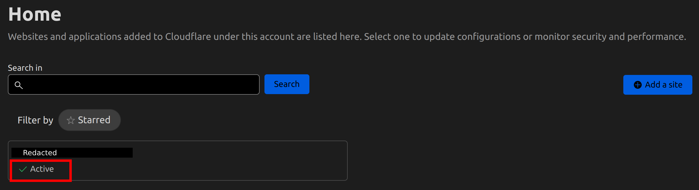

> More in this series: [Part 1: Setting up the Network](/home-server/pt-1-setting-up-the-network/) [💾 Part 2: Configuring Zero Trust Access to your Server 💾](/home-server/pt-2-configuring-zero-trust-access/) [Part 3: Hosting your Personal Git Server with Gitea and Docker](/home-server/pt-3-hosting-a-personal-git-server/)

## Introduction

In my [last post](/home-server/pt-1-setting-up-the-network/#zero-trust-model), I briefly mentioned of a way to access resources on your server without exposing any ports or opening your firewall. In this post, I will go in further depth about the required configuration to enable this access.

Before we begin, I must confess this method is not truly free. It does require that you own a domain name. Depending on the domain name provider, this might even be more expensive than purchasing a static IP. I went with this method because of two reasons:

1. I already own a domain name
2. The domain itself is cheaper (not to mention, more secure) than purchasing a static ip.

However, even if that wasn't the case, I personally believe that it is far better to use this model instead of exposing ports on your own. 

| | Zero Trust        | Exposed Ports and Firewall |
|  :---------------:  | :---------------: | :------------------------: |
| **Security**        |Your server is off the internet. No ingress is allowed, means no packets reach your server | Your server is visible to port scanning tools such as nmap |
| **Management**      |Configuration is handled by zero trust service providers. This means that they handle any and all security updates | Depending on the access measures you put in place, you would need to constantly update packages and dependencies to ensure your server stays safe |
| **Integration**     | Most Zero Trust service providers allow integration with other applications for IAM using SAML, for example, Google Cloud Identity or Microsoft Entra ID (formerly, Azure AD) | You will have to manually set up any IAM |

In this post, I will be using Cloudflare's Zero Trust, which has a very generous forever free plan for upto 50 users (see [pricing](https://www.cloudflare.com/plans/zero-trust-services/)), so you can even allow access to your family and friends. You can read a detailed overview of the services it provides on their website [here](https://developers.cloudflare.com/cloudflare-one/).

### Requirements

Before we begin, we need,

- A Domain Name (such as `example.com`)
- A Cloudflare Account ([Sign Up](https://dash.cloudflare.com/sign-up) if you dont have one already)

## Step 1: Readying our domain

If you purchased your domain through Cloudflare, there is nothing you need to do in this step. If not, we need to ensure the domain is using Cloudflare's nameservers before we can move ahead. I will coalesce the key steps here, for a detaield guide refer to their [documentation](https://developers.cloudflare.com/dns/zone-setups/full-setup/setup/).

Before you begin, ensure that you have **disabled** DNSSEC at your registrar where you bought your domain.
> DNSSEC stands for DNS Security Extensions. It increases security by adding cryptographic signatures to DNS records, which can then be checked to verify that a record came from the correct DNS server, preventing anyone from impersonating and issuing false DNS records on your behalf and redirecting traffic intended for your domain
  
Don't worry, we can re-enable DNSSEC once we are done switching the nameservers. Disabling/Enabling DNSSEC can take anywhere from 5 minutes to around a week to propagate.

### 1.1: Add your domain to Cloudflare

1. Log on to your Cloudflare [dashboard](https://dash.cloudflare.com/login).
2. On the top navigation bar's right crner, click on **Add site**.

3. Enter your website's apex domain (`example.com`) and then click Add Site.
4. Select the Free Plan.
5. Review your DNS records.

Cloudflare automatically scans for common records and adds them to the DNS zone. The scan is **not** guaranteed to find all your existing records, so cross-check from your registrar and add any missing records

6. Click **Done, check nameservers**.
7. Follow the on-screen instructions and Quick Start Guide. You can enforce security by enabling **Always Use HTTPS** and **Automatic HTTPS Rewrites**. The latter prevents end users from seeing mixed content errors by rewritting URLs from http to https for resources that can be served with HTTPS.
8. When you're done with the guide, click Finish.

### 1.2: Get New Nameservers

1. On the Cloudflare dashboard, select your account and domain.
2. On **Overview**, locate the nameserver names in **2. Replace with Cloudflare's nameservers**. Keep this window open for next steps.

### 1.3: Update Nameservers at Registrar

1. Log in to the admin account for your domain registrar. You can find your provider using [ICANN WHOIS](https://whois.icann.org/) (though I'm assuming you already know if you are someone who can log in to the admin account).
2. Follow your registrar's steps to use custom nameservers and add the nameservers provided by Cloudflare (The open tab from the previous step). You can find some provider specific instructions at Cloudflare's [documentation](https://developers.cloudflare.com/dns/zone-setups/full-setup/setup/#update-your-registrar)
3. Wait for a few minutes ~ 24 hours for the registrar to update your nameservers. When your domain is **Active**:
    - You will receive an email from Cloudflare
    - Your domain will have a status of **Active** on the **Websites** page of your account dashboard

### 1.4: Enable DNSSEC (Optional)

If you wish to enable DNSSEC on your domain,

1. Log in to the Cloudflare Dashboard and select your account and domain.
2. Go to **DNS > Records**.
2. Also open **DNS > Settings** in a new tab.
4. For **DNSSEC**, click **Enable DNSSEC**.
5. Follow the on-screen instructions to create the **DS** record.

Note that these changes can take a few days to propagate.

## Step 2: Setting up Zero Trust

Now we are ready to use Zero Trust to access resources on our server from our own domain. 

**Note:** You may have to provide your credit/debit card's details, but you will **not** be charged. It's just to keep on file.

1. On the left navigation bar of your Cloudflare Dashboard, select **Zero Trust**.

2. On the onboarding screen, choose a team name. A team name is a unique identifier for your Zero Trust organization. Users (anyone accessing the resources on the server) will enter this team name when they enroll their device
3. Complete your onboarding by selectinga subscription plan. Since we are going for a personal use server, the free plan is more than enough. Select **Zero Trust Free Plan**.

That's it! You're ready to access applications behind your server!

You can configure the access control using multiple methods. If you do not have an Identity provider (I recommend you look into Google Cloud Identity, since you already have a domain at this point), you can also authenticate users via a simple One-Time Pin (OTP) to approved email addresses. You can simply add specific email addresses to an [Access Policy](https://developers.cloudflare.com/cloudflare-one/policies/access/) and to the group that allows people to reach the application.

A good place to start understanding the various access methods would be Cloudflare's docs for [Zero Trust](https://developers.cloudflare.com/cloudflare-one/setup/), and [Identity](https://developers.cloudflare.com/cloudflare-one/identity/)

## Step 3: Connecting to our Server

Cloudflare Zero Trust enables access to your server by building a tunnel between your machine and Cloudflare's edge. It works by installing a lightweight daemon process in your server — `cloudflared`, that creates outbound-only connections to Cloudflare's own network.

You can use Cloudflare Tunnel to connect to HTTP Web Servers, SSH Servers, RDP to a desktop, and other protocols.

To learn more about how this works, refer [Cloudflare Tunnel](https://developers.cloudflare.com/cloudflare-one/connections/connect-networks/)

There are two ways to create a tunnel. Cloudflare has a pretty good documentation of the process, so I will simply link it here.
1. [Remotely managed](https://developers.cloudflare.com/cloudflare-one/connections/connect-networks/get-started/create-remote-tunnel/) (via Cloudflare Dashboard)
2. [Locally managed](https://developers.cloudflare.com/cloudflare-one/connections/connect-networks/get-started/create-local-tunnel/) (via CLI on your server)

That's about it. This post was more of a culmination of the various options I looked into, and is by no means exhaustive. It serves more as a reference on a possible option (the only good one) I've found to reach my resources securely without getting into a hassle with ISPs.

For an example of accessing your resources protected with SSL using Cloudflare Zero Trust, check out my next post on setting up a personal Git server [here](/home-server/pt-3-hosting-a-personal-git-server/).

Thank you for reading!
