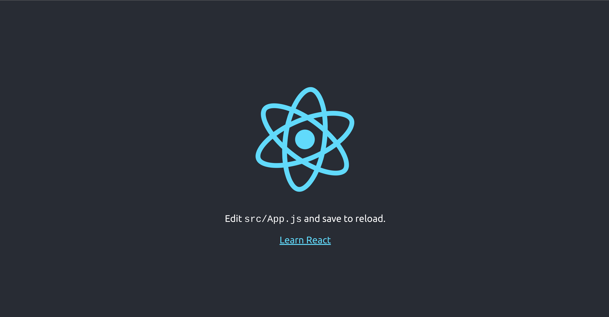
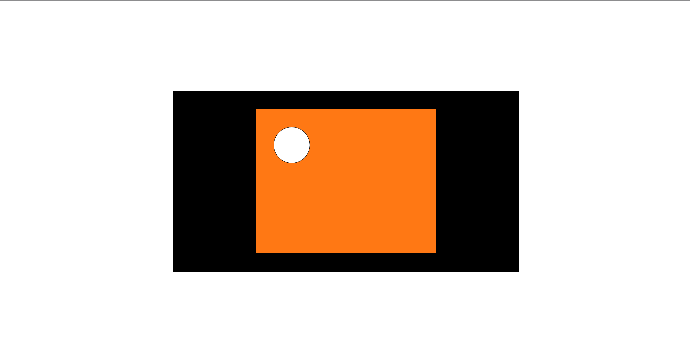
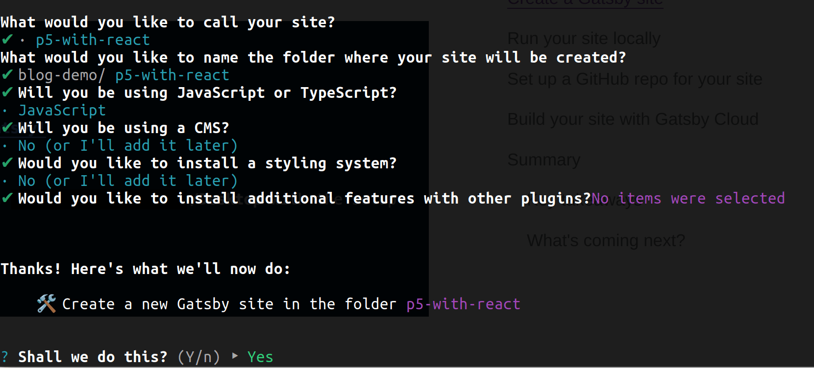
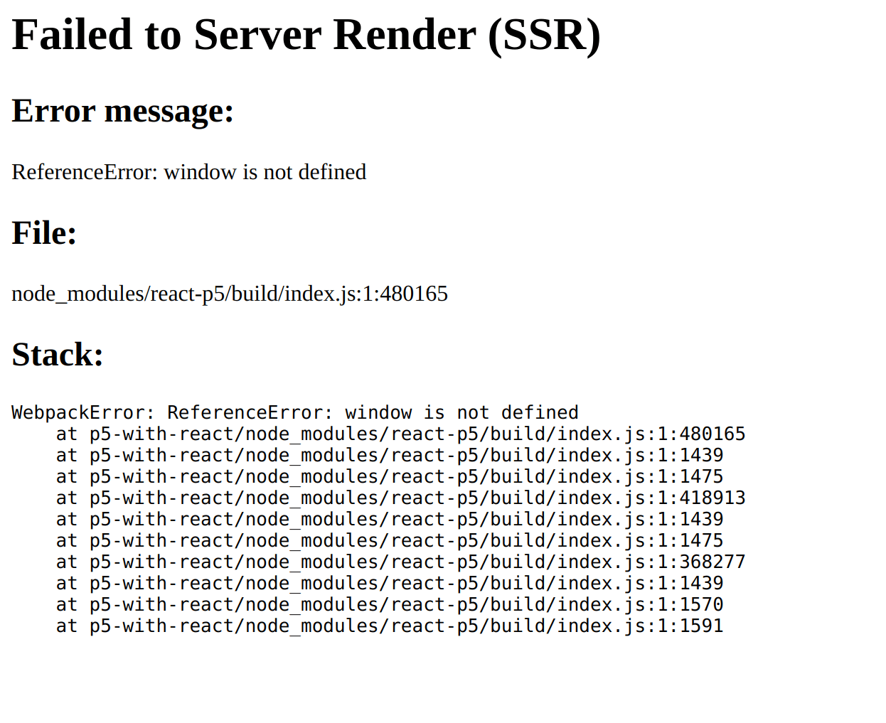
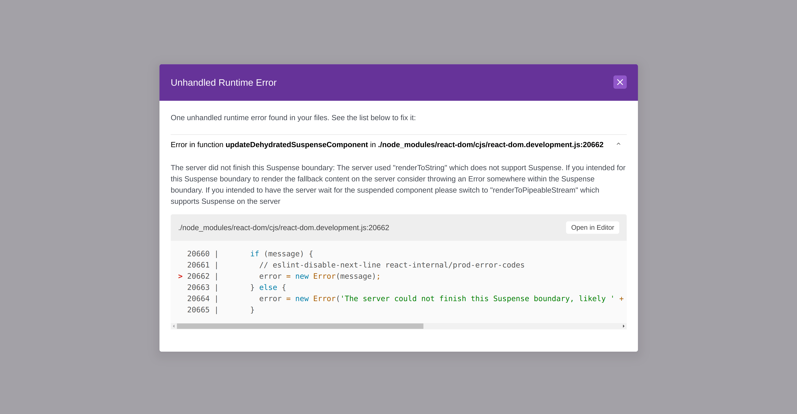

## Introduction

P5 is a popular framework for creating complex canvas sketches. In the words of the library, [p5](https://p5js.org/) is a JavaScript library for creative coding, inclusive for artists, designers, educators, beginners, and anyone else].

In this post, we are going to show 2 ways to add p5 sketches to your React application.

- The first method involves using a package `react-p5`, which will work for your standard React App, but not if you use Server Side Rendering.
- The second method works even if you are using Server Side Rendering.

If you use a framework like Gatsby or Next.js, the first method will **not** work as they use SSR. Use the second method instead.

## Method 1: Using `react-p5`

### Setting up a React App

Let's quickly spin up a simple React app using [create-react-app](https://create-react-app.dev/).

In your terminal, run 
```shell
npx create-react-app react-p5-demo
```

This will create a folder in your current directory called react-p5-demo, initialize it as a git repository, and install React dependencies.

Let's get this running.
```shell
cd react-p5-demo
npm run start
```

This will start a live development server on your network. You should see something like the below image in your browser.



Let's modify the default `App.js` file and get a container ready to display our p5 sketch.

Navigate to `src/App.js` and replace it's contents with the following:
```js
import './App.css';
import P5Sketch from './components/p5-sketch';

function App() {
  return (
    <div className='container'>
      <div className='sketch'>

      </div>
    </div>
  );
}

export default App;

```

Edit `src/App.css` and replace it with the following:
```css
.container {
  position: relative;
  left: 50%;
  top: 50%;
  transform: translate(-50%, 50%);
  background-color: black;
  width: 50vw;
  height: 50vh;
}

.sketch {
  position: absolute;
  left: 50%;
  top: 50%;
  transform: translate(-50%, -50%);
}
```

We just removed CRA's standard boilerplate code. Save this and you'll see a blank screen with a black container in it's center. This will be the container for our p5 sketch.


Now that the basic setup is done, let's get started with p5.

### Adding p5

In a separate terminal window, run
```shell
npm install react-p5
```

We'll create a component to store our Sketch in.

Create a file `src/components/p5-sketch.js` and paste the following code in it.

```js
import React from 'react';
import Sketch from 'react-p5';

function P5Sketch() {
    const setup = (p5, canvasParentRef) => {

    }

    const draw = (p5) => {

    }

    return (
        <Sketch setup={setup} draw={draw} />
    )
}

export default P5Sketch;
```

This is the basic flow for all your p5 sketches, with a setup function and a draw function.
There are many more functions which can be passed to the p5 Sketch, such as `windowResized`, `mouseClicked`, `mouseMoved`, etc.

I'll pick a basic sketch from [this](https://levelup.gitconnected.com/integrating-p5-sketches-into-your-react-app-de44a8c74e91) blog for the purpose of this.

Now let's actually create the sketch.
We'll create a canvas in the setup function and draw a basic circle in the draw function.

Update the `src/components/p5-sketch.js` file as such:
```js
import React from 'react';
import Sketch from 'react-p5';

function P5Sketch() {
    const setup = (p5, canvasParentRef) => {
        p5.createCanvas(500, 400).parent(canvasParentRef);
    }

    const draw = (p5) => {
        p5.background(255, 120, 20);
        p5.ellipse(100, 100, 100);
    }

    return (
        <Sketch setup={setup} draw={draw} />
    )
}

export default P5Sketch;
```

Essentially, anything you put in your vanilla p5 script is now put in a function that takes p5 as input to expose it's methods.

Save this, but you will not see it in your browser just yet. We need to add this component in our `src/App.js` file for it to be visible.

```js
import './App.css';
import P5Sketch from './components/p5-sketch';

function App() {
  return (
    <div className='container'>
      <div className='sketch'>
        <P5Sketch />
      </div>
    </div>
  );
}

export default App;
```

When you save this, you'll see an orange rectangle with a circle in our sketch container.



And that's it! You've successfully added a p5 sketch into your React Application. You can style the container in any manner you like.

### Animating the sketch

This sketch does look a bit boring thought. Let's animate the ball to bounce on canvas edge.
To make the ball move in a straight line, we only need to edit it's x coordinate on the canvas

We'll store the ball's x-coordinate in a variable `x` and the speed of movement in a variable `speed`.

Update the code in `src/components/p5-sketch.js` as follows:
```js
import React from 'react';
import Sketch from 'react-p5';

var x = 50;
var speed = 5;
function P5Sketch() {
    const setup = (p5, canvasParentRef) => {
        p5.createCanvas(500, 400).parent(canvasParentRef);
    }

    const draw = (p5) => {
        p5.frameRate(30);
        // If we're travelling towards the right or left
        if (speed > 0) {
            // If the ball has reached the end of the container or not
            if (x + 50 < p5.width) {
                x += speed
            } else {
                speed = -speed;
            }
        } else {
            if (x - 50 > 0) {
                x += speed;
            } else {
                speed = -speed;
            }
        }

        p5.background(255, 120, 20);
        p5.ellipse(x, 100, 100);
    }

    return (
        <Sketch setup={setup} draw={draw} />
    )
}

export default P5Sketch;
```

Save this and check your browser and you'll see a ball bounce against the walls of the orange container.

The possibilities of what you can do with p5 from here on out are endless. For some cool and fancy sketches and more information on p5, I recommend checking out Daniel Shiffman's [Coding Challenges](https://www.youtube.com/playlist?list=PLRqwX-V7Uu6ZiZxtDDRCi6uhfTH4FilpH) from his Youtube.

### Caveats of this method
`react-p5` expects the `window` object to be defined at import time. This will throw a `'window is not defined` error if you are using Server Side Rendering, since the window object is not defined on the Node server.

## Trying to get the same result in Gatsby with SSR enabled

Let's try to get the same sketch in Gatsby, a React framework that uses SSR.

## Setting up a Gatsby Site

From Gatsby's [tutorials](https://www.gatsbyjs.com/docs/tutorial/part-0/), install the Gatsby CLI globally:

```shell
npm install -g gatsby-cli
```
and create a new Gatsby site
```shell
gatsby new
```

You'll be followed with a few prompts asking you about the site name, if you'd like to use JavaScript or TypeScript, and if you'll be using a CMS or Styling system. Don't bother with the latter for now. You can always add them later.

For the purpose of this, let's call the site p5-with-react.


Let's also enable DEV_SSR, a flag in Gatsby that let's you see issues and warnings that might pop-up during build or deployment due to SSR.

In your site directory and add the following lines to the top of `gatsby-config.js`

```js
module.exports = {
  flags: {
    DEV_SSR: true
  },
  // Rest of the content ...
}
```

Let's start this site up on a live development server.

```shell
npm run develop
```

You'll see the gatsby boilerplate code on initial startup. We'll update `src/pages/index.js` as we did `App.js` for CRA.

```js
import * as React from "react"

const containerStyles = {
  position: 'relative',
  left: '50%',
  top: '50%',
  transform: 'translate(-50%, 50%)',
  backgroundColor: 'black',
  width: '50vw',
  height: '50vh',
}

const sketchStyles = {
  position: 'absolute',
  left: '50%',
  top: '50%',
  transform: 'translate(-50%, -50%)',
}

const IndexPage = () => {
  return(
    <div style={containerStyles}>
      <div style={sketchStyles}>

      </div>
    </div>
  )
} 

export default IndexPage
```

### Adding `react-p5`

Again, let's add the `react-p5` package, create a component for the sketch, and add it to our `index.js` file. The steps for this are the same as those for CRA so I'll skip them here.

#### Errors with SSR

Now on a live development server, at this point, nothing would feel wrong. The animation shows up and plays as expected. But refresh the website and you'll be greeted with a nice, **Failed to Server Render (SSR) error**


One of the go-to method to fix this issue is to [lazy-load](https://reactjs.org/docs/code-splitting.html#reactlazy) the module that needs the window object (in our case, `react-p5`).

Let's updated our `src/components/p5-sketch.js` component to do the same.

First, we change the import statement to
```js
// import Sketch from 'react-p5';
const Sketch = React.lazy(() => import('react-p5'));
```

Next, we wrap our returned Sketch component in a [React.Suspense](https://beta.reactjs.org/reference/react/Suspense) component
```js
    return (
        <React.Suspense fallback={<div>Loading...</div>}>
            <Sketch setup={setup} draw={draw} />
        </React.Suspense>
    )
```

Save this. Although you may expect it to work, it does not. You'll be greeted with another error. **The server did not finish this Suspense boundary**


So now what? Have we reached a dead-end on adding p5 to our site?

Nope!
Now we go to method 2, which does not depend on a 3rd party package such as `react-p5`, and works without any issues even with SSR.

## Method 2: Using `ref`
We'll continue using the gatsby site created above.

Stop the live development server.

First, let's remove `react-p5` from our dependencies and add the regular `p5` package.
```shell
npm unsinstall react-p5
npm install p5
```

We'll use this p5 package directly.

Let's empty our Sketch Component.
```js
import React from 'react';

const P5Sketch = () => {
    return(<></>)
}

export default P5Sketch;
```

Now let's start. 
Start your live development server
```shell
npm run develop
```

First, we only want to import p5 when the `window` object is defined. To do so, we will import it inside a `useEffect` callback. This callback function is only run during rendering, so it won't be run on the server.

```js
const P5Sketch = () => {
    useEffect(() => {
        const p5 = require("p5");
    }, [])
    // ...
}
```

We pass an empty dependency list since we only want to call this on the first render and not on subsequent renders.
Now, we create a new p5 object with the help of its instance constructor. This object will have access to all properties and methods related to a p5 sketch such as setup and draw.

```js
const P5Sketch = () => {
    useEffect(() => {
        const p5 = require("p5");

        new p5(p => {
            p.setup = () => {

            }

            p.draw = () => {
                
            }
        })
    }, [])
    // ...
}
```

Finally, to be able to provide this p5 sketch to our React component, we will make use of [Refs](https://reactjs.org/docs/refs-and-the-dom.html). 

In short, a ref provides a way to access DOM nodes or React elements created in the render method.

```js
import React, { useEffect, useRef } from 'react';

const P5Sketch = () => {
    const renderRef = useRef();

    useEffect(() => {
        const p5 = require("p5");

        new p5(p => {
            p.setup = () => {
                p.createCanvas(500, 400).parent(renderRef.current);
            }

            p.draw = () => {
                
            }
        })
    }, [])

    return(
        <div ref={renderRef}></div>
    )
}

export default P5Sketch;
```

Essentially, we defined the p5 canvas to consider the element pointed to by `renderRef` as it's parent.

Save it and notice you won't see any errors, even with SSR.
Let's add our `draw` logic to complete the animation. The final `p5-sketch.js` component is:
```js
import React, { useEffect, useRef } from 'react';

var x = 50;
var speed = 5;
const P5Sketch = () => {
    const renderRef = useRef();

    useEffect(() => {
        const p5 = require("p5");

        new p5(p => {
            p.setup = () => {
                p.createCanvas(500, 400).parent(renderRef.current);
            }

            p.draw = () => {
                p.frameRate(30);
                // If we're travelling towards the right or left
                if (speed > 0) {
                    // If the ball has reached the end of the container or not
                    if (x + 50 < p.width) {
                        x += speed
                    } else {
                        speed = -speed;
                    }
                } else {
                    if (x - 50 > 0) {
                        x += speed;
                    } else {
                        speed = -speed;
                    }
                }
        
                p.background(255, 120, 20);
                p.ellipse(x, 100, 100);
            }
        })
    }, [])

    return(
        <div ref={renderRef}></div>
    )
}

export default P5Sketch;
```

Save it, and voila! You now have a p5 sketch working in your react app even with Server Side Rendering enabled!


Thanks for reading. I hope you found this post helpful!